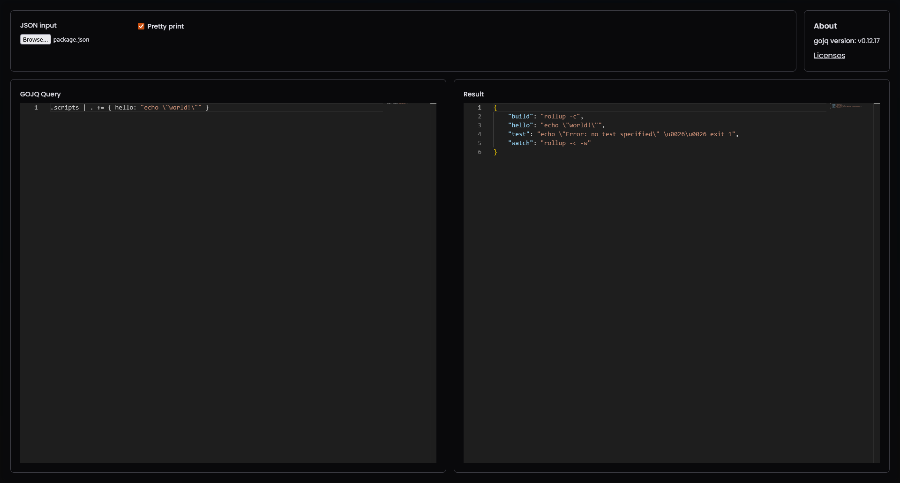

# GOJQ-web

It is a simple wrapper around [itchyny/gojq](https://github.com/itchyny/gojq), compiled to WASM, with a simple web UI for live edits.
Its main goal is to test your queries before using them with [gojq](https://github.com/itchyny/gojq) or [jq](https://github.com/jqlang/jq) (be warned of [the differences](https://github.com/itchyny/gojq?tab=readme-ov-file#difference-to-jq)).

## Screenshot


## How to use
- Select a JSON file with the file input
- Compose your query
- You have the result (limited to 100 entries for now) on the right editor.

## How to build

### Requirements
- Go 1.23
- Make
- go-licenses `go install github.com/google/go-licenses@latest`

or

- Docker

### Build natively
Run
```sh
make build
```
Now you can either:
- serve the `front` directory with a web server,
- or you can run the standalone server at `bin/file-server` by running
  ```sh
  bin/file-server
  ```
  and you can change the port with the environment variable `PORT`
  ```sh
  PORT=7777 bin/file-server
  ```

### Build with Docker
Run
```sh
make docker
```
Now you can run the image with
```sh
docker run -p 8080:8080 -d ghcr.io/entrivax/gojq-web
```