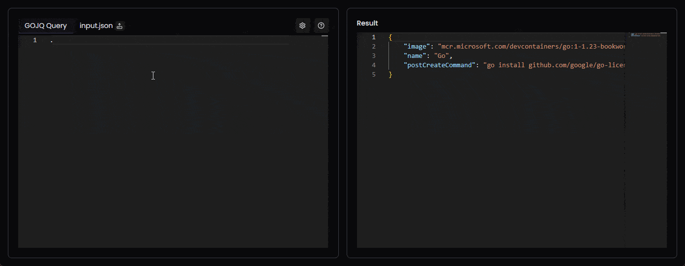

# GOJQ-web

It is a simple wrapper around [itchyny/gojq](https://github.com/itchyny/gojq), compiled to WASM, with a simple web UI for live edits.
Its main goal is to test your queries before using them with [gojq](https://github.com/itchyny/gojq) or [jq](https://github.com/jqlang/jq) (be warned of [the differences](https://github.com/itchyny/gojq?tab=readme-ov-file#difference-to-jq)).

## Screenshot


## How to use
- Select a JSON file with the file input
- Compose your query
- You have the result on the right editor.

## How to build

### Requirements
- Go 1.26
- Make
- go-licenses `go install github.com/google/go-licenses@latest`
- Docker or a static web server

### Build for a static web server
Run
```sh
make build-gojq
```
Then you can copy the `front` folder to your static web server to serve it.

### Build with Docker
Run
```sh
make docker
```
Now you can run the image with
```sh
docker run -p 8080:80 -d ghcr.io/entrivax/gojq-web
```
